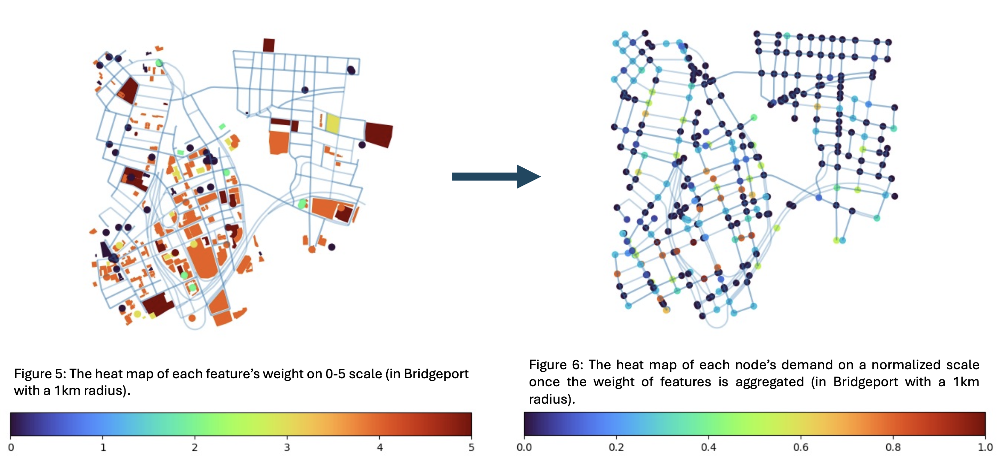

# Marley Research Papers

## Upcycling Cotton-Elastane

*Extraction of Cellulose Nanocrystals via Sulfuric Acid Hydrolysis from Post- Consumer Cotton-Elastane Textile Blends with Elastane Recovery*
   * [Abstract](./cotton-elastane/abstract.pdf)
   * [Poster](./cotton-elastane/poster.pdf)
   * [Paper](./cotton-elastane/paper.pdf)

## Charging Infrastructure Optimization

*Reinforcement Learning Optimization of Placement of Public Vehicle Charging Stations using a Novel Parking Demand Model*

   * [Abstract](./charger-rl/abstract.pdf)
   * [Poster](./charger-rl/poster.pdf)
   * [Paper](./charger-rl/paper.pdf)

## License

Copyright © 2025 by Marley Wies.

See [LICENSE.txt](./LICENSE.txt) for specific licenses.