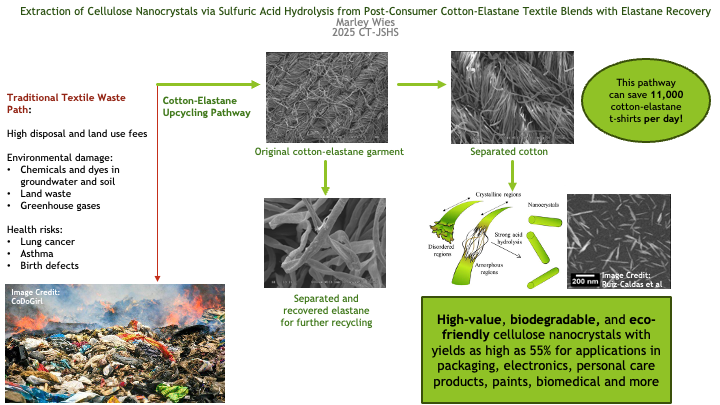
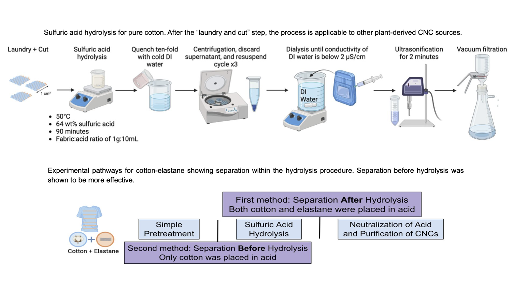

# Marley Research Papers

*Extraction of Cellulose Nanocrystals via Sulfuric Acid Hydrolysis from Post- Consumer Cotton-Elastane Textile Blends with Elastane Recovery*
   * [Abstract](./cotton-elastane/abstract.pdf)
   * [Poster](./cotton-elastane/poster.pdf)
   * [Paper](./cotton-elastane/paper.pdf)

## License

Copyright © 2025 by Marley Wies.

See [LICENSE.txt](./LICENSE.txt) for specific licenses.